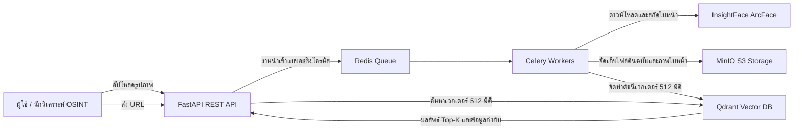
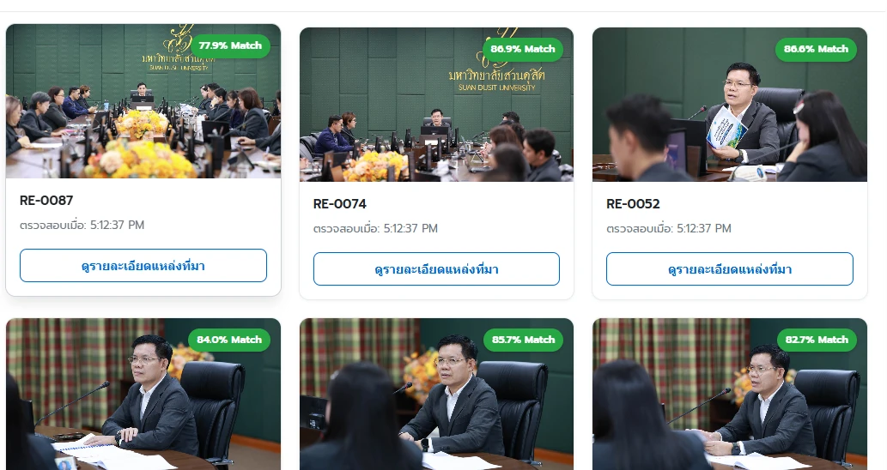

# 🎯 Face: ระบบค้นหาใบหน้าแบบย้อนกลับและระบบรู้จำใบหน้า

Face คือระบบ OSINT แบบครบวงจรและกระจายการทำงาน สำหรับรับรูปภาพจากแหล่งข้อมูลบนเว็บ สกัดเวกเตอร์ใบหน้าขนาด 512 มิติที่ผ่านการทำให้เป็นมาตรฐานด้วย **InsightFace ArcFace** จัดทำดัชนีเวกเตอร์ลงใน **Qdrant Vector DB** โดยใช้ดัชนี HNSW และระยะห่างแบบ Cosine พร้อมให้บริการ REST API ที่รวดเร็วสำหรับการค้นหาใบหน้าแบบย้อนกลับ

---

## 🏗️ สถาปัตยกรรมระบบ



## ⚡ เริ่มต้นใช้งานอย่างรวดเร็ว

### 1. รันด้วย Docker Compose

```bash
docker compose up -d --build
```

- เอกสาร API แบบโต้ตอบด้วย Swagger: http://localhost:8000/docs
- หน้าจอค้นหาเว็บและระบบ AI Recon: http://localhost:8000/ui

### 2. การเร่งความเร็วด้วยฮาร์ดแวร์และการตั้งค่าข้ามแพลตฟอร์ม

Face รองรับการเร่งความเร็วด้วยฮาร์ดแวร์โดยอัตโนมัติในหลายแพลตฟอร์ม:

- **Windows / Linux (NVIDIA GPU):** ใช้ CUDA (`CUDAExecutionProvider`) หรือ DirectML (`DmlExecutionProvider`)
- **macOS (Apple Silicon M1/M2/M3/M4):** ใช้ Apple Neural Engine / GPU (`CoreMLExecutionProvider`) หรือ CPU ประสิทธิภาพสูงบนสถาปัตยกรรม ARM64

### 🍏 การตั้งค่า macOS (รูปแบบ Hybrid ที่แนะนำ)

Docker Desktop บน macOS ไม่สามารถส่งต่อ Apple GPU/Metal เข้าไปยัง Linux containers ได้โดยตรง เพื่อประสิทธิภาพสูงสุด ให้รันฐานข้อมูลด้วย Docker และรัน AI engine บนเครื่องโดยตรง:

```bash
# 1. เริ่มต้น Qdrant, Redis และ MinIO ด้วย Docker
docker compose up -d qdrant redis minio

# 2. ติดตั้ง Xcode command line tools และ cmake
#    (จำเป็นสำหรับการ build InsightFace)
xcode-select --install
brew install cmake

# 3. สร้าง virtual environment และติดตั้ง Face
python3 -m venv .venv
source .venv/bin/activate
pip install -e ".[dev]"

# 4. เริ่มต้น API Server
uvicorn app.main:app --host 0.0.0.0 --port 8000 --reload
```

### 🪟 Windows / Linux ที่ใช้ NVIDIA GPU

```bash
pip install -e ".[dev,gpu]"
uvicorn app.main:app --host 0.0.0.0 --port 8000 --reload
```

## 📡 จุดเชื่อมต่อ API

### 1. การค้นหาใบหน้าแบบย้อนกลับ

- **Endpoint:** `POST /api/v1/search`
- **Content-Type:** `multipart/form-data`
- **พารามิเตอร์:**
  - `file`: ไฟล์รูปภาพประเภท JPG, PNG หรือ WEBP
  - `face_index`: ดัชนีใบหน้าที่ต้องการค้นหา (ค่าเริ่มต้น: `0` = ใบหน้าที่มีขนาดใหญ่ที่สุด)
  - `top_k`: จำนวนผลลัพธ์ที่ต้องการ (ค่าเริ่มต้น: `10`)
  - `score_threshold`: ค่าขีดจำกัดความคล้ายคลึงแบบ Cosine (ค่าเริ่มต้น: `0.6`)

### 2. การนำเข้ารูปภาพจาก URL

- **Endpoint:** `POST /api/v1/ingest`
- **Body:**

```json
{
  "url": "https://target-source.org/photo.jpg",
  "metadata": {
    "case_id": "OSINT-2026-001",
    "source": "web_archive"
  }
}
```

### 3. การตรวจสอบสถานะระบบ

- **Endpoint:** `GET /api/v1/health`
- ส่งกลับสถานะของ API, collection ใน Qdrant Vector DB และระบบจัดเก็บข้อมูล

## 🧪 การทดสอบ

```bash
pytest tests/ -v
```

การทดสอบทั้ง unit tests และ integration tests จะทำงานด้วย Qdrant แบบ in-memory และชุดรูปภาพทดสอบที่สร้างขึ้นสำหรับการทดสอบโดยเฉพาะ

## 📊 ผลการทดสอบ: ค้นหาใบหน้าจากเว็บไซต์

ทดสอบโหมด **สแกนจากเว็บไซต์ (Live)** ผ่านหน้า `/ui` (`POST /api/v1/scan-stream`) โดยอัปโหลดภาพเป้าหมาย 1 ภาพ ระบบตรวจพบ 2 ใบหน้า และเลือกใบหน้าหลัก (เป้าหมาย 1, confidence 0.84) เพื่อค้นหาบนเว็บไซต์มหาวิทยาลัยสวนดุสิต

| รายการ | ค่า |
|---|---|
| URL ที่สแกน | `https://www.dusit.ac.th/home/?s=สภาคณาจารย์` |
| ระดับความลึก (Max Pages) | 200 |
| Threshold | 0.50 |
| สภาพแวดล้อม | Windows 10, Python 3.13, uvicorn (ไม่ใช้ Docker), Qdrant in-memory, local storage |

**ผลลัพธ์ ณ เวลาบันทึกภาพ** (สแกนไป 80 จาก 1,652 ภาพ ใช้เวลาประมาณ 414 วินาที):

- ตรวจสอบใบหน้าทั้งหมด **314** ใบหน้า
- พบภาพที่ตรงกับบุคคลเป้าหมาย **12** ภาพ ความคล้ายคลึง (Cosine Similarity) **64.1% – 86.9%**



| ความคล้ายคลึง | แหล่งที่มา |
|---|---|
| 86.9% | RE-0074 |
| 86.8% | RE-0006 |
| 86.6% | RE-0052 |
| 85.7% | RE-0034 |
| 84.0% | RE-0015 |
| 82.7% | RE-0027 |
| 81.2% | จัดประชุมสภาคณาจารย์และพนักงาน ครั้งที่ 4(9)2569 |
| 78.5% | การประชุมสภาคณาจารย์และพนักงาน มหาวิทยาลัยสวนดุสิต ครั้งที่ 1/2568 |
| 77.9% | RE-0087 |
| 71.4% | การประชุมสภาคณาจารย์และพนักงาน มหาวิทยาลัยสวนดุสิต ครั้งที่ 2/2568 |
| 65.8% | ประกาศผลรางวัลโครงการ "สร้างความสุข ขยับกาย สบายชีวี ท้าเพื่อนดี SDU 10Fit10" |
| 64.1% | จัดประชุมสภาคณาจารย์และพนักงาน ครั้งที่ 12(17)/2569 |
